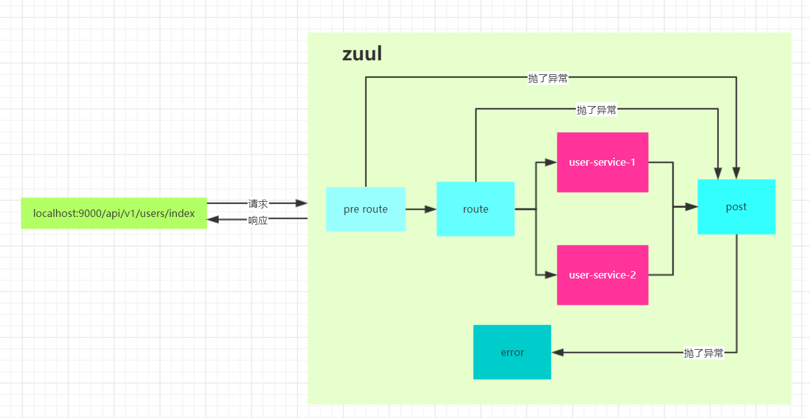

# Spring Cloud 学习模块

## 前言
### 几个问题
* **Q:什么叫微服务?**
* **A:以前单体项目是将所有的默认都写在一起，比如一个项目中存在user、order、goods模块。此时若
  系统中查看goods详情的api挂了，最终这个api一直被访问，可能会导致这个项目宕机。最终这个项目都
  会挂掉。或者在项目开发的时候，若我只修改了用户登录功能的地方。我们需要将整个项目重启才能测试
  这个功能。微服务的概念就是将user、order、goods模块给`分离`, 它们可以使用自己的数据库，它们
  之间的交互可以采用一定的协议来交互，比如:http或rpc**
  
---
* **Q:什么叫分布式?**
* **A:分布式与微服务很像。也是将一些模块抽出去，非单体项目。但分布式架构主要解决的问题是并发量
  过高导致服务器处理不过来。所以分布式一般是将不同的模块部署在不同的服务器上**
  
---
* **Q:微服务与分布式的区别**
* **A:基本上没有什么区别，基本上都是对模块的抽离。微服务的核心是将模块分离开来。而分布式的核心是
  将项目中的模块部署在不同机器上来达到缓解服务器压力的功能，若一个单体项目部署在一台机器上，而这台机
  器可能承受不了这么大的并发量所以就会将这个单体项目升级成微服务部署，若服务器还是胜任不了压力，那么
  就会考虑分布式部署了。总而言之，分布式是微服务的一种，而微服务可以部署在一台机器上**

---
* **Q:微服务遇到的问题及解决方案**
* **A:
  1. 微服务是将模块分离出来，若项目比较大，承受压力比较大，最终会做集群，此时需要做负载均衡 ----> ngxin, ribbon可以解决 
  2. 微服务调用链中，若一个服务有问题，为了不让一个服务影响整个业务逻辑，则还需要对有问题的服务做熔断处理 ---> hystrix
  3. 服务间暴露的端口比较多，为了统一管理、安全、服务间路由的定义和过滤，则需要添加网关 ---> zuul能处理
  4. 服务间如何针对某个服务的宕机而忽略它，即服务注册与发现监听 --> eureka或zookeeper也能完成
  **

## 一、自定义微服务模块 customize-wfw
### 1.1 地址

* [https://github.com/AvengerEug/spring-cloud/tree/develop/customize-wfw](https://github.com/AvengerEug/spring-cloud/tree/develop/customize-wfw)

### 1.2 各服务端口汇总

|       服务名        |   端口    |
| :-----------------: | :-------: |
|       eureka        |   8000    |
|        zuul         |   9000    |
|   config-service    |   4000    |
|    user-service     |   5000    |
| order-service(集群) | 6001/6002 |
| goods-service(集群) | 7001/7002 |

### 1.3 每个服务实现自己的负载均衡策略功能实现步骤

* 背景:

  ```
  假设有两个微服务，分别为order和goods。并且它们都集群部署了。 现在要在user服务中调用order和goods服务的api，要实现对order服务实现自定义的负载均衡算法: `每个实例被连续调用两次后再轮询到另外一个实例`。goods服务要使用普通的轮询算法: `即每个服务调用一次后就轮到其他实例`
  ```

* 实现步骤:

  1. 新建两个类，里面分别维护了两个**IRule**类型的对象。eg，如下:

     ```java
     // OrderServiceLoadBalance.java
     @Configuration
     public class OrderServiceLoadBalance {
     
         @Bean
         public IRule orderServiceLoadBalanceRule() {
             return new SecondRuleForLoadBalance();
         }
     
     }
     ```

      

     ```java
     // UserServiceLoadBalance.java
     @Configuration
     public class UserServiceLoadBalance {
     
         @Bean
         public IRule userServiceLoadBalanceRule() {
             return new RoundRobinRule();
         }
     }
     ```

     `注意事项: `

     ```markdown
     1. 维护负载均衡对象的类必须是一个`@Configuration`注解标识的类
     2. 此对象不能被springboot项目扫描得到。即不能在springboot启动类所在包及其子包下。若扫描到的话，在进行微服务调用时会抛异常(大致的异常就是IRule对象会被其他对象依赖，会根据类型自动注入，但是因为被扫描到了，所以有多个相同类型的对象，spring不知道注入哪一个，所以抛了异常)
     ```

  2. 添加如下自定义注解:

     ```java
     @Target(ElementType.TYPE)
     @Retention(RetentionPolicy.RUNTIME)
     @ComponentScan(excludeFilters = {
             @ComponentScan.Filter(type = FilterType.REGEX, pattern = Constants.USER_SERVICE_EXCLUDE_PACKAGE)
     })
     @RibbonClients({
             @RibbonClient(name = "ORDER-SERVICE", configuration = OrderServiceLoadBalance.class),
             @RibbonClient(name = "USER-SERVICE", configuration = UserServiceLoadBalance.class)
     })
     public @interface EnableCustomizeLoadBalance {
     }
     ```

     注意事项: 

     ```markdown
     1. Constants.USER_SERVICE_EXCLUDE_PACKAGE的值就是手写loadBalance算法类以及上述维护两个@Configureation注解标识的类所在的包
     2. 这个注解的@ComponentScan注解将Constants.USER_SERVICE_EXCLUDE_PACKAGE所在包下的所有类给剔除了，不会被扫描到。
     3. @RibbonClients注解表示具体维护要调用的负载均衡策略。如上，服务名叫"ORDER-SERVICE"的服务名的负载均衡算法使用OrderServiceLoadBalance类中维护的IRule类型的对象，其中ORDER-SERVICE这个值就是order模块中注册到eureka的服务名，就是order模块中配置文件为spring.application.name的值
     ```

  3. 启动自定义负载均衡算法功能, 在user模块中添加@EnableCustomizeLoadBalance注解，如下:

     ```java
     @EnableCustomizeLoadBalance
     @SpringBootApplication
     @EnableEurekaClient
     public class UserServiceApplication {
     
         public static void main(String[] args) {
             SpringApplication.run(UserServiceApplication.class);
         }
     }
     ```

     注意事项: 

     ```markdown
     1. @EnableCustomizeLoadBalance注解必须要写在@SpringBootApplication注解上面。若写在下面，则@EnableCustomizeLoadBalance注解中的过滤扫描包的功能会不起作用。则会抛上述所说的异常。具体原因待研究。
     2. 若单独将@EnableCustomizeLoadBalance注解中的@ComponentScan和@RibbonClients注解内容直接搬到UserServiceApplication类中，那么久不会出现上述所说的异常，具体原因待研究。
     ```

  4. 至此，不同微服务使用不同的负载均衡算法的功能点完成。可以使用如下url进行测试:

     ```tex
     1. http://localhost:5000/v1/users/get-goods  -> user服务调用goods服务api。
        结果: 一次显示goods1。另外一次显示goods。然后轮询显示 => 用的是默认轮询算法
     2. http://localhost:5000/v1/users/get-orders  -> user服务调用order服务api
        结果: 两次显示goods2。两次显示goods1。然后轮询显示  => 用的是自定义的轮询算法
     ```

  5. 最后，因为spring cloud中具有负载均衡功能的组件是ribbon，而ribbon的负载均衡架构是cs模式。所以我们做的负载均衡策略都是写在cs端。就当前demo而言，因为user要调用order和goods服务的api，所以user就相当于是client端。所以要将这些配置加在user这个模块中

  6. [参考官网url:https://cloud.spring.io/spring-cloud-static/Finchley.SR4/single/spring-cloud.html#_customizing_the_ribbon_client](https://cloud.spring.io/spring-cloud-static/Finchley.SR4/single/spring-cloud.html#_customizing_the_ribbon_client)
  
     
  
### 1.4 使用feign组件代替restTemplate来进行服务间调用

  1. 什么是feign?
  
     ```text
     Feign是一个声明式webservice的客户端。spring对这个组件进行了封装，使用方式和spring mvc的api接口定义方式类似。它可以与eureka、ribbon结合，与它们集成后feign能使用ribbon的负载均衡策略
     ```
  
  2. feign能干什么？
  
     ```reStructuredText
     spring cloud中微服务的调用方式是采用http的形式来执行的。所以我们需要编写http请求方面的代码。当微服务之间交互比较多时，就需要编写很多的重复代码。而feign类似于mybatis的接口，不需要实现类，只需要接口即可。底层使用代理的技术将http请求操作给封装了。我们只需要按照spring修改后的规则进行编写，就能实现api的调用
     ```
  
  3. 如何使用？
  
     1. 添加feign依赖(不同版本的spring cloud可能会出现依赖包artifactid不一致问题，具体可参考官网, Finchley.SR2版本依赖的feign的artifactid为)
       
        ```xml
        <dependency>
        	<groupId>org.springframework.cloud</groupId>
        	<artifactId>spring-cloud-starter-openfeign</artifactId>
        </dependency>    
        ```
       
     2. 在项目入口处添加@EnableFeignClients注解
       
     3. 编写接口，实现对具体服务的请求api。eg，user模块中编写要调用order模块的client
       
        ```java
        @FeignClient("ORDER-SERVICE")
        public interface OrderFeignClient {
        
            @GetMapping("/v1/orders/index")
            Message getOrders();
        }
        ```
        
     4. 调用接口
       
        从spring容器中获取到orderFeignClient这个bean，或者自己自动装配到一个controller中。最终直接调用这个bean的getOrders方法即可。 feign会发送 http://ORDER-SERVICE/v1/orders/index 这个api。最终请求到order模块对应的api。eg:
       
        ```java
        @RestController
        @RequestMapping("/v1/users")
        public class UserController {
        	@Autowired
            private OrderFeignClient orderFeignClient;
            
            @GetMapping("/get-feign-orders")
            public Message getFeignOrders() {
                return orderFeignClient.getOrders();
            }
            
        }
        ```
     
### 1.5  Hystrix(断路器)

1. 什么叫Hystrix?

   ```
   官网权威说明:  https://github.com/Netflix/Hystrix/wiki#what
   大致的意思就是: Hystrix是一个处理分布式系统的延迟和容错的开源库。在分布式系统里，许多依赖不可避免的会调用失败，比如超时、异常等。Hystrix 能够保证在一个依赖出问题的情况下，不会导致整体服务失败，避免级联故障，以提高分布式系统的弹性。
   ```

2. 有什么用？

   ```
   先描述下这样的一个场景:
   	假设一个项目中有User模块，Order模块，goods模块。当用户下单时，先进入订单模块，但是要下订单还需要商品信息，所以还需要到goods模块中去拿商品信息，而商品信息可能还需要用户信息，所以goods模块还需要从user模块中去拿数据。 这样的下单逻辑就是一块调用链，若其中goods模块到user模块拿用户数据时，user模块因为各种原因暂时挂了(因为资源被占用完了，拿用户信息的请求线程被挂起了)，那么最终就会导致下单的逻辑一直处于进行中，导致下单页面一直在转圈圈(非单页面项目)或者页面一直没反应，停留在下单页面(单页面项目)。若此时多个用户同时执行了下单逻辑，导致所有的请求都卡到user模块这，最终就会导致order模块、user模块、goods模块全部崩掉(因为每个微服务的线程一直在等user模块返回数据，所以就挂在那里。当线程数把应用设置的最大运行内存给占满后，应用就会挂掉，最终就会导致整个微服务雪崩)。
   	
   Hystrix就是解决这样的问题的，它能够hold住这种情况，当微服务中的某个微服务出现问题时，不会出现这种雪崩的情况。
   
   这里总结下user模块出现问题的情况:
     1. 程序出bug
     2. 数据库正常返回
     3. 缓存击穿、雪崩
     4. 响应过慢
     5. 数据库有脏数据
     6. 等等等等
     
   所以Hystrix针对上述可能出现的问题提供了一套解决方案:
     1. 方法降级: 假设有个getUser的方法出了bug，导致请求一直没有相应。这个时候就可以备份一个getUser的方法(假设getUserFallBack)，所以可以设置若getUser方法执行时间超过了多少秒就使用getUserFallBack的方法作为返回值, 或者直接抛出异常说"服务繁忙，请稍后再试".
     2. 服务熔断: 设置一段时间内，服务未响应的次数超过指定次数(全部可以配置，默认是10s内失败20次，将会开启服务熔断)时，则将请求到此服务的请求进行方法降级处理
     3. 服务限流: 为某一个api设置一个线程池大小，若满了则走降级方法。否则继续走正常方法
     4. 请求超时监听: 请求超时监听是Hystrix 默认存在的，最终的处理方法就是方法降级来达到服务的可用性。但是它和feign一起用的时候，会出现一个bug，目前我遇到的就是它会连续call两次feign调用的方法
     
    注意: 方法降级和超时监听都是做到客户端的，为什么呢？因为我作为请求方我才能知道这个请求超过多少秒是我不能接受的，然后再请求对方降级的api即可。
     
   ```
   
3. 案例

   * 测试前提:

     ```
     启动eureka、订单两个服务(order-service, order-service-2), 商品两个服务(goods-service, goods-service-2)、用户服务(user-service)
     ```

     

   * 3.1 方法降级demo

     

     ```java
     
     /**
     1. 浏览器访问localhost:5000/v1/users/get-feign-orders
     2. 此api内部使用的是feign调用，且订单服务做了集群(order-service服务中的api抛出了异常，order-service-2服务中的api正常返回)。所以会走负载均衡，又因为订单服务使用的是自定义的负载均衡算法。
     所以当请求到order-service-2服务中的api时，会正常响应。当请求到order-service服务中的api时，则会走降级方法(getFeignOrdersFallBack), 降级方法的返回值要一致
     **/
     @HystrixCommand(fallbackMethod = "getFeignOrdersFallBack")
     @GetMapping("/get-feign-orders")
     public Message getFeignOrders() {
         return orderFeignClient.getOrders();
     }
     
     public Message getFeignOrdersFallBack() {
         return Message.error("系统正在维护中，请稍后再试");
     }
     ```

     

   * 3.2 服务熔断demo

     ```java
     /**
      1. 浏览器输入: http://localhost:5000/v1/users/index-circuit-breaker
      2. 设置了熔断机制:
            当这个api5s内失败了5次请求，那么就会走降级方法。
         此api中设计了一个算法，当circuitBreakerAtomic变量的值大于10时，则返回正确结果，否则抛出异
         常。该异常会被hystrix捕获，最终走降级方法。而因为配置了5s内失败5次也会走降级方法。
         所以我们为了区分是因为抛出异常而走的降级方法还是因为熔断走的降级方法。
         我们最好使用jemet工具或者postman工具模拟1000个请求。然后根据打印circuitBreakerAtomic的值的
         log信息来区分，总共有多少个线程进入了这个api。从而验证了断路器是否起作用
     **/
     @HystrixCommand(
     	fallbackMethod = "getUsersFallBack",
     	commandProperties = {
     		@HystrixProperty(name = "circuitBreaker.sleepWindowInMilliseconds", value = "5000"),
              @HystrixProperty(name = "circuitBreaker.requestVolumeThreshold", value = "5")
          }
     )
     @GetMapping("/index-circuit-breaker")
     public Message getUsersCircuitBreaker() throws Exception {
     
         circuitBreakerAtomic.incrementAndGet();
     
         logger.info("circuitBreakerAtomic value is {}", circuitBreakerAtomic);
     
         if (circuitBreakerAtomic.get() < 10) {
             throw new Exception();
         }
     
         return Message.ok();
     }
     
     public Message getUsersFallBack() {
         return Message.error("系统正在维护中，请稍后再试 -- getUsersFallBack");
     }
     ```

   * 3.3 服务限流demo

     ```java
     /**
       1. 浏览器输入: localhost:5000/v1/users/index-limiting
       2. 此api添加了限流的相关配置
          commandKey="limiting"和threadPoolKey="limiting"分别对应了下述yml文件中command和threadpool
          节点下的limiting。最终会将yml配置文件中值加载进来
          
          大致配置了该api线程池大小为2，且hystrix的超时时间达到了20s才走降级方法
          因为api中线程休眠了10s，所以测试很简单，直接使用jemet或postman请求三次，能发现第三个请求直接
          走了降级方法。
     **/
     @HystrixCommand(
             fallbackMethod = "getUsersFallBack",
             commandKey = "limiting",
             threadPoolKey = "limiting"
     )
     @GetMapping("/index-limiting")
     public Message getUsersLimiting() {
         logger.info("Requesting /index-limiting api");
         try {
             Thread.sleep(10000);
         } catch (InterruptedException e) {
             e.printStackTrace();
         }
         return Message.ok();
     }
     
     public Message getUsersFallBack() {
         return Message.error("系统正在维护中，请稍后再试 -- getUsersFallBack");
     }
     ```

     ```yml
     # application.yml
     hystrix:
       threadpool:
         limiting:
           coreSize: 2
       command:
         limiting:
           execution:
             isolation:
               thread:
                 timeoutInMilliseconds: 20000
     ```

   * 3.4 请求监听超时demo

     ```java
     /**
       1. 浏览器输入 localhost:5000/v1/users/index-time-out
       2. 此api添加了请求超时相关的配置
          具体为超时时间为3s，若超过了3s则走降级方法。
          此方法很简单，随机生产一个小于5的整数，所以此方法会根据随机后的数据来决定是否走降级方法
     */
     @HystrixCommand(
     	fallbackMethod = "getUsersFallBack",
     	commandProperties = {
     		@HystrixProperty(name = "execution.isolation.thread.timeoutInMilliseconds", value = "3000")
          }
     )
     @GetMapping("/index-time-out")
     public Message getUsersTimeout() {
     	int sleepSecond = new Random().nextInt(5);
     
          logger.info("Sleep time is {} second", sleepSecond);
          try {
          	Thread.sleep(sleepSecond * 1000);
          } catch (InterruptedException e) {
              e.printStackTrace();
          }
     
         return Message.ok();
     }
     
     public Message getUsersFallBack() {
         return Message.error("系统正在维护中，请稍后再试 -- getUsersFallBack");
     }
     
     ```

   * 3.5 ribbon组件提供的feign与hystrix集成 

     * 添加实现了feignClient接口的类作为降级处理类, eg: 项目中的`OrderFeignClientHystrix`类

     * 将降级处理类添加至feignClient中。eg: `OrderFeignClient`类的`@FeignClient`注解的**fallback**属性

     * 配置hystrix属性，这里提供单独为某个方法的配置

       ```yml
       hystrix:
         command:
           # 为配置到具体feign的某个方法，可以使用default作为全局配置
           # 这里有个知识点: HystrixCommandKey  ->  
           # 当@HystrixCommand注解添加到方法时，这个HystrixCommandKey就是方法名
           # 当HystrixCommandKey为default时。就是所有hystrix共享的
         	"OrderFeignClient#getFeignOrdersTimeout()":
             execution:
               isolation:
                 thread:
                   timeoutInMilliseconds: 3000
       ```

     * 启动feign的hystrix功能

       ```yml
       feign:
         hystrix:
           enabled: true
       ```

     * 延长ribbon的重试机制(若不延长，那么在hystrix的可允许超时时长内，ribbon(也就是feign)会启动它的重试机制，会再请求一次(这个一次也是可以配置的)，配置这个是有原因的，后面会说明)

       ```yml
       feign:
         client:
           # 看源码得知: config是一个map的数据结构，default为key
           config:
             # 服务名, 配置在@FeignClient注解中的服务名，当然有可以使用default。这样的话所有的feign都会共用这个配置
             ORDER-SERVICE:
               connectTimeout: 11000
               readTimeout: 11000
       ```

     * 进行测试: 拿UserControll中的getFeignOrdersTimeout() api来测试

       ```markdown
       1. 浏览器输入: localhost:5000/v1/users/get-feign-orders-time-out
       2. 此api内部会使用feign调用order服务，而order服务有两个实例，且使用的自定义负载均衡算法(每个实例都会请求到两次后再轮询到下一个实例)。因为自定义负载均衡算法的原因，为了让它生效，所以我延长了ribbon的重试配置。让它大于hystrix的超时时间，这样重试机制就不会生效了(其实可以直接关闭重试机制的，这块我还没找到解决方案，所以就先这样处理了)。`order-service`服务中的api休眠了2s。order-service-2服务中的api休眠了5s。因为hystrix配置了超时时间为3s。所以当请求到达order-servie-2服务时，会走降级方法(降级处理类对应的方法名的逻辑)。当请求到达order-service服务时，因为休眠了2s，所以会正常返回
       ```

### 1.6 Zuul


1. 什么是zuul?

   ```
   
   ```

2. 有什么用

   ```
   zuul主要包含了对请求的路由和过滤两个最主要的功能:
   1. 其中路由功能负责将外部请求转发到具体的微服务实例上，是实现外部访问统一入口的基础。而过滤器功能则负责队请求的处理过程进行干预，是实现请求校验、服务聚合等功能的基础
   2. Zuul和Eureka进行整合，将zuul自身注册为eureka服务治理下的应用(也属于注册到eureka的一个微服务)，同时eureka中获得其他微服务的信息，以便以后的访问微服务都是通过zuul跳转
   ```

3. 为什么要加入zuul

   ```
   1. 首先，从zuul作为请求的路由角色来说。假设我们的client需要调用具体的某一个微服务的api. 
      第一: 我们需要指定具体某一个未付的ip地址、端口。这其实是有安全隐患的。
      第二: client我们无法统一确定请求的url路径。
      添加了zuul作为路由之后，我们可以直接通过微服务名来访问具体的微服务实例
   
   ```


4. zuul工作流程:

   ```
   本质: 本质上也是一个spring mvc的web项目
   入口: DispatcherServlet.java的doService方法
   流程:
      1. 拿到request
      2. 根据request拿到handler
         -> 遍历所有的handlerMappings, 其中只有ZuulHandlerMapping能够返回handler，所以调用它的getHandler方法，但是它没有实现这个方法，所以最终执行的父类AbstractHandlerMapping的getHandler方法，当在执行lookupHandler方法时，因为自己(ZuulHandlerMapping)有实现lookupHandler方法，所以又跳到自己的lookupHandler方法了。在此方法中做了三件事情: 
         1. 到ThreadLocal中拿请求上下文(RequestContext, zuul将tomcat传来的request存入了RequestContext对象中)来决定是否是内部转发操作。
         2. 拿到zuul配置的路由并将它们注册到handler中: 相当于spring mvc中的映射关系与controller相关联，会将配置的所有路由映射到ZuulController.  eg: /v*/users/**  -> ZuulController
         3. 调用父类的lookupHandler方法查找真正的handler(ZuulController -> 实现了org.springframework.web.servlet.mvc.controller接口)
      3. 根据handler找handlerAdapter(SimpleControllerHandlerAdapter, )
      4. 调用handlerAdapter的handle方法
         -> 最终调用到ZuulControll中的handleRequestInternal方法。ZuulController没有做啥事，空壳方法，主要调用了父类ServletWrappingController的handleRequestInternal方法。在父类ServletWrappingController中，维护了一个ZuulServlet，最终会调用ZuulServlet的service方法。在ZuulServlet的service方法中主要做了4件事。
         1. 将当前的request，response信息放入ThreadLocal中
         2. preRoute: 预处理路由, 将sType=pre的预处理路由的过滤器执行一遍
         3. route: 路由，将sType=route的路由过滤器执行一遍
         4. postRoute: 将sType=post的路由过滤器执行一遍
         
         上述的处理路由过程都可以从thread中拿到request和response，其中在第三件事的过程中，会执行到一个叫RibbonRoutingFilter的过滤器，其中在此过滤其中会对request进行真正的请求，最终会将threadLocal中的response进行填充，zuul将会根据这个response进行响应，所以所谓的404、500等状态码的reponse都是在此过滤器中执行的
      5. 至此，zuul的路由功能完成！
   ```

5. zuul的过滤器(核心): 

   * zuul的过滤器分为四种: error、post、pre、route(在FilterConstants.java文件中可见)

   * 每种类型的过滤器的处理时机如下图所示:

     

   * 自定义过滤器实现步骤: 参考官网: [https://cloud.spring.io/spring-cloud-static/Finchley.SR4/single/spring-cloud.html#_custom_zuul_filter_examples](https://cloud.spring.io/spring-cloud-static/Finchley.SR4/single/spring-cloud.html#_custom_zuul_filter_examples)

   * 需要注意的点:

     ```
     每个类型的过滤器都有一个默认的，而且它们都有一个对应的order的值。
     在添加自定义过滤器时，肯定是有业务需求的，比如pre类型的过滤器可以验证权限等等。
     但是因为有order属性的存在，所以我们必须要确认自己写的过滤器的执行顺序是怎样的。要确认这个问题的话，我们必须要确认每个类型的默认过滤器的作用是什么。
     比如pre类型的默认过滤器是: PreDecorationFilter.java ，这个过滤器就是处理request，为请求转发到具体的服务做准备，内部会将一些信息(要跳转的服务id、url等等)。假设我们有需求要处理这个request的内容，那么就必须把自定义的过滤器的执行顺序放在PreDecorationFilter的后面。
     
     具体规则是： order的值越小，越先执行
     ```

6. zuul的容错

   * 官方文档建议做法: [https://cloud.spring.io/spring-cloud-static/Finchley.SR4/single/spring-cloud.html#hystrix-fallbacks-for-routes](https://cloud.spring.io/spring-cloud-static/Finchley.SR4/single/spring-cloud.html#hystrix-fallbacks-for-routes)

     1. 步骤一: 创建一个类型为**FallbackProvider**的bean

        ```java
        class UserServiceFallbackProvider implements FallbackProvider {
        
            /**
             配置在zuul中路由的service-id(源码: org.springframework.cloud.netflix.zuul.filters.route.support.AbstractRibbonCommand#getFallbackResponse方法
                 protected ClientHttpResponse getFallbackResponse() {
                    Throwable cause = getFailedExecutionException();
                    cause = cause == null ? getExecutionException() : cause;
                    // 是根据serviceId
                    return zuulFallbackProvider.fallbackResponse(context.getServiceId(), cause);
                }
             )
             若返回的是一个"*" 或 null => 那么则表示针对所有的路由都使用此容错器
            */
            @Override
            public String getRoute() {
                return "users-service";
            }
        
            /**
              回退方法，当zuul将请求转发给微服务发生了错误时。
              会执行此方法响应一个ClientHttpResponse出去
            */
            @Override
            public ClientHttpResponse fallbackResponse(String route, final Throwable cause) {
                if (cause instanceof HystrixTimeoutException) {
                    return response(HttpStatus.GATEWAY_TIMEOUT);
                } else {
                    return response(HttpStatus.INTERNAL_SERVER_ERROR);
                }
            }
        
            private ClientHttpResponse response(final HttpStatus status) {
                // 返回一个ClientHttpResponse, 其中要实现部分函数
                return new ClientHttpResponse() {
                    /**
                      响应的状态码对象
                    */
                    @Override
                    public HttpStatus getStatusCode() throws IOException {
                        return status;
                    }
        
                    /**
                      响应的状态码的值, eg: 200, 401, 500, 502
                    */
                    @Override
                    public int getRawStatusCode() throws IOException {
                        return status.value();
                    }
        
                    @Override
                    public String getStatusText() throws IOException {
                        return status.getReasonPhrase();
                    }
        
                    @Override
                    public void close() {
                    }
        
                    /**
                      响应的具体内容
                    */
                    @Override
                    public InputStream getBody() throws IOException {
                        return new ByteArrayInputStream("fallback".getBytes());
                    }
        
                    /**
                      支持对response的header做处理
                    */
                    @Override
                    public HttpHeaders getHeaders() {
                        HttpHeaders headers = new HttpHeaders();
                        headers.setContentType(MediaType.APPLICATION_JSON);
                        return headers;
                    }
                };
            }
        }
        ```

     2. 添加@Component注解加入到spring容器中，与官网的** you can provide a fallback response by creating a bean of type `FallbackProvider`**相对应

     3. zuul的容错器完成, 测试时, 可以将路由的那个微服务给停止，这样就会请求超时(默认是与hystrix结合，hystrix默认超时1s)，就会走容错器
   
7. zuul集群:

   ```shell
   # 请参考此项目的 zuul-cluster分支，或直接clone此分支代码
   git clone https://github.com/AvengerEug/spring-cloud.git -b zuul-cluster
   
   ```
   
### 1.7 spring cloud 配置中心

* 步骤

  * 服务端

    1. 添加服务端依赖

    ```xml
    <dependency>
        <groupId>org.springframework.cloud</groupId>
        <artifactId>spring-cloud-config-server</artifactId>
    </dependency>
    ```

    2. 项目入口类添加@EnableConfigServer注解

    3. application.yml文件添加如下配置

       ```yml
       server:
         port: 4000
       spring:
         application:
           name: config-service # {application}
         cloud:
           config:
             server:
               # 采用git作为远程仓库的方式获取配置文件
               git:
                 uri: https://github.com/AvengerEug/spring-cloud.git
                 # 到指定文件夹中拿文件
                 search-paths: customize-wfw/configs
             # 标签
             label: develop
       ```
       
    4. 完成注册中心服务端的配置, 可以按照[spring cloud官网推荐的规则进行查看](https://cloud.spring.io/spring-cloud-static/Finchley.SR4/single/spring-cloud.html#_quick_start), 简单规则如下:
    
       ```yml
       /{application}/{profile}[/{label}]
       /{application}-{profile}.yml
       /{label}/{application}-{profile}.yml
       /{application}-{profile}.properties
       /{label}/{application}-{profile}.properties
       ```
    
       我们可以访问: `http://localhost:4000/develop/eureka8000-local.yml` 即访问develop分支的eureka8000-local.yml文件，此时该文件的内容会在浏览器中被渲染出来
    
  * 客户端配置
  
    1. 添加客户端依赖
  
       ```xml
       <dependency>
           <groupId>org.springframework.cloud</groupId>
           <artifactId>spring-cloud-starter-config</artifactId>
       </dependency>
       ```
  
    2. 添加bootstrap.yml文件, 并且添加如下配置
  
       ```yml
       spring:
         application:
           name: eureka8000
         profiles:
           active: local
         cloud:
           config:
             uri: http://localhost:4000
             label: develop
       ```
  
       此bootstrap.yml文件的权重比application.yml文件重，若两个文件有相同属性的配置，最终会按照bootstrap.yml文件中配置生效。而此配置的含义就是会从配置中心(http://localhost:4000)去拿文件,拿哪一个文件呢？ 拿develop分支的`eureka8000-local.yml`文件, 规则就是: `{spring.application.name}-{spring.profiles.active}.yml`
  
  * 总结:
  
    spring cloud 提供的配置中心可支持远端配置，但不支持热更新。即不需要启动服务的前提下，服务能读取到更新后的配置文件。其实也可以，spring cloud提供了spring cloud bus，原理就是利用了github的webhook(钩子函数)，github在文件更新时能触发一些钩子函数，我们可以与 github做交互，当github通知更新时，再到对应的服务中去更新缓存中的配置文件(这样的话，每个服务都要做这样的事). 其实大多数分布式项目中，使用最多的配置中心是携程的`apoll`。在apoll的光环下，spring cloud提供的配置中心略微逊色。

### 1.8  spring cloud  sleuth (zipkin)链路跟踪

* 进入官网下载相关jar包或者docker镜像启动zipkin服务(本项目路径zipkin文件夹中存在一个zipkin的jar包，可以直接使用java -jar 启动，zipkin也是使用spring boot开发的)

* 配置zipkin的客户端

  1. 添加zipkin的依赖

     ```xml
     <!-- 包含了spring-cloud-starter-sleuth -->
     <dependency>
         <groupId>org.springframework.cloud</groupId>
         <artifactId>spring-cloud-starter-zipkin</artifactId>
     </dependency>
     ```

  2. 在需要对请求进行根据的微服务中添加如下配置:

     ```yml
     spring:
       # zipkin的服务地址
       zipkin: http://localhost:9411 # zipkin的默认端口 9411
       sleuth:
       	sampler:
           # 设置链路追踪的api数量, 1.0 = 100% 即表示追踪所有的请求链路, 默认为0.1, 即只接收百分之10的请求
           probability: 1.0
     ```

  3. 服务搭建完成，可以测试: 依次请求`config-service, eureka, user-service, order-service, order-service-2 `服务，并请求`http://localhost:5000/v1/users/get-feign-orders`api. 然后可以在zipkin首页(http://localhost:9411/zipkin)中查询出链路。

  4. 具体参考本项目的`zipkin`分支

### 1.9 Eureka组件原理

* 为什么要引入Eureka？

  ```txt
  在微服务项目中，我们的每个模块都是一个单独的项目，部署之后就是一个单独的进程。模块与模块之间是要交互的，那进程与进程之间要怎么进行交互呢？只能使用RPC(远程服务调用)的概念，但是RPC的只是一个概念、只是一个思想，要实现这个功能我们可以通过网络来交互。但是呢，要使用网络，我们必须得知道对方的ip是什么、端口是什么。于是我们会浅显的认为，我们可以在每个服务中维护一下对方的ip地址和端口呀。没错，这是个解决方案，但是假设在集群部署下，我一个模块的实例就有上千台，所以，还觉得维护对方ip地址和端口的方式很好吗？这也与微服务的低耦合思想相悖。那么要怎么办呢？此时就需要一个服务注册中心服务，需要这个服务来维护我当前项目中所有微服务的一些信息。比如说服务a在启动的过程中就发送一个register请求把自己服务的相关信息（ip、端口、服务名等等等等）传给服务注册中心，由服务注册中心去管理这些信息。同时我定时的往服务注册中心去拉取现在已经存活的其他服务，以便日后交互使用。在spring cloud中，eureka就是这样的一个服务注册中心、并且它底层是使用http协议来进行交互的。你以为服务注册中心就仅仅做这一件事情吗？咱们来多想几种情况：
  1. 假设服务a注册到eureka了，那么eureka要怎么才能知道服务a到底有没有挂呢？于是引出了一个心跳检测(服务续约)的机制
  2. 假设服务a注册到eureka了，但是服务a挂了，导致长时间没有做续约操作，那么eureka就会认为它挂了，就会把它删掉。于是引出了服务剔除功能
  3. 假设此时服务a和服务b都注册到eureka了，服务a要怎么调用服务b的方法呢？于是引出了服务发现的功能
  
  
  在eureka底层中，是使用ConcurrentHashMap存储这些注册的服务，其中key为服务名，value为一个map，value中的map的key是当前服务对应的实例名，value为具体的实例的信息。
  这也就说明了为什么eureka在集群搭建时，服务名必须要一样，而实例id可以不一样
  ```

* Eureka是一个开源项目，不是spring开发的，只不过springcloud把eureka封装了一层，可以无缝对接spring。Eureka作为注册中心是采用http协议来进行服务注册、服务发现、服务续约、服务剔除、服务下线等功能的。但它底层用的是**jersey**框架，是另外的一种MVC框架，它和spring mvc类似，只不过jersey是使用过滤器进行拦截，而spring mvc是通过拦截器进行拦截的。

#### 1.9.1 服务注册原理

* 在eureka源码中，处理http请求的控制器位于**com.netflix.eureka.resources**包下。当我们启动一个服务往eureka注册服务时，注册方会像eureka发送一个post请求，最终就会进入**com.netflix.eureka.resources.ApplicationResource#addInstance**方法进行注册。其中，它内部使用了一个叫**责任链的设计模式(定义一个接口，使用一个基类来实现核心方法，剩下的逻辑由子类去实现。最终由子类开始调用这个方法，当子类完成了对应的逻辑后，再调用父类的方法，一层层递进。这样的设计就达到了单一性，每个类只负责自己的逻辑)**来完成服务的注册。其中会校验一些参数、发布一个**EurekaInstanceRegisteredEvent**的事件，可以通知其他监听者做特定的操作，最终在**com.netflix.eureka.registry.AbstractInstanceRegistry#register**类中完成了服务的注册。其中底层使用的是ConcurrentHashMap来作为服务注册表，同时它是一个嵌套的map，key为服务名。value为一个map，内部map中的key为服务的id，value为具体服务对应的值。采用这种设计可以很方便的实现eureka的集群搭建。